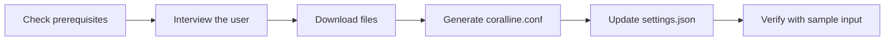

# coralline — AI Installation Playbook

> **You are an AI coding assistant** (Claude Code or similar) and a user asked you to install
> coralline. Follow this playbook top to bottom. Do not skip the interview step — letting the
> user pick their own colors and layout is the whole point of this installer.

## Overview

coralline is a powerline-style statusline for Claude Code. Installation means placing two files
and registering the script in `settings.json`:

| Artifact | Destination | Purpose |
|---|---|---|
| `statusline.sh` | `~/.claude/coralline/statusline.sh` | The statusline renderer |
| `configure.sh` | `~/.claude/coralline/configure.sh` | Visual setup wizard and reconfiguration entrypoint |
| `themes/<chosen>.conf` | `~/.claude/coralline/themes/<chosen>.conf` | Color palette |
| `sample-input.json` | `~/.claude/coralline/sample-input.json` | Local preview + verification sample |
| generated config | `~/.claude/coralline.conf` | User's layout + theme choices |
| `statusLine` entry | `~/.claude/settings.json` | Registers the script |



## Fast path

If you are working from a local clone, prefer the built-in wizard:

```bash
bash configure.sh --install
```

If the repository has not been cloned yet:

```bash
git clone https://github.com/Nanako0129/coralline ~/.claude/coralline-src
bash ~/.claude/coralline-src/configure.sh --install
```

The wizard copies the renderer and bundled themes, updates `settings.json`, offers the
default config, local `~/.p10k.zsh` import when present, or a visual wizard, then verifies the
final render with sample input. Use the manual steps below only when the wizard cannot run in
the current environment.

## Step 1 — Check prerequisites

```bash
command -v jq || echo "MISSING: jq"
command -v git && bash --version | head -1
```

> **Note:** `jq` is required. If missing, offer to install it (`brew install jq` on macOS,
> `apt/dnf install jq` on Linux) before continuing. `git` is optional — the git segment
> silently disappears without it.

> **Windows:** coralline is a bash script. Claude Code runs it through **Git Bash** when
> installed, or PowerShell otherwise. If the user is on Windows, confirm Git Bash is present
> (`git --version` from a Claude Code shell, or check for `C:/Program Files/Git`). If Git Bash
> is absent, tell the user coralline needs [Git for Windows](https://git-scm.com/download/win)
> plus `jq`; there is no native PowerShell version yet. Use forward slashes in the
> `settings.json` command path on Windows.

## Step 2 — Interview the user

Use your interactive question tool (e.g. `AskUserQuestion`). If you have no such tool, ask in
plain text and wait for answers. Ask these five questions — include the preview blocks so the
user can compare themes visually:

> **Note:** before asking, check whether `~/.p10k.zsh` exists. If it does, offer the
> Powerlevel10k import (Step 2.5) as the first option — p10k users usually want their
> existing look carried over, which answers most of these questions automatically.

### Question 1 · Theme

| Option | Palette |
|---|---|
| `claude-coral` | steel blue · mauve · coral (default) |
| `catppuccin-mocha` | pastel blue · green · mauve on dark |
| `nord` | frost cyan · green · purple, arctic tones |
| `gruvbox-dark` | retro blue · aqua · orange, warm cream text |
| `tokyo-night` | neon blue · green · purple on deep navy |
| `dracula` | cyan · pink · purple on Dracula charcoal |
| `mono` | grayscale, minimalist |

Use ASCII previews shaped like the real bar, for example:

```text
claude-coral:     ~/proj  ⎇ main  ◆ Fable 5  ⬡ ▰▰▰▱▱ 62%  ⊙ 2:45 pm
tokyo-night:      ~/proj  ⎇ main  ◆ Fable 5  ⬡ ▰▰▰▱▱ 62%  ⊙ 2:45 pm
```

### Question 2 · Style

| Option | Config to write | Looks like |
|---|---|---|
| Pill (default) | `VL_STYLE="pill"` | powerline pills with colored backgrounds |
| Lean | `VL_STYLE="lean"` | flat colored text, like Powerlevel10k's lean preset |

```text
pill:   ~/proj  ⎇ main  ◆ Fable 5  ⊙ 14:45     (colored capsule backgrounds)
lean:   ~/proj  ⎇ main  ◆ Fable 5  ⊙ 14:45     (no backgrounds, colored text)
```

### Question 3 · Segments (multi-select)

| Segment | Shows | Default |
|---|---|---|
| `dir` | current directory (shortened) | on |
| `git` | branch, dirty marks `+!?`, ahead/behind `⇡⇣` | on |
| `model` | active Claude model | on |
| `ctx` | context-window gauge + token counts | on |
| `limit5h` / `limit7d` | rate-limit gauges with reset countdown | on |
| `cost` | session cost in USD | on |
| `clock` | current time | on |
| `lines` | lines added/removed this session | off |
| `style` | active output style | off |
| `duration` | session wall-clock duration | off |
| `effort` | reasoning effort level (`ψ`) | off |
| `stash` | git stash count | off |
| `project` | stable repo name (`⬢`), same across all git worktrees | off |

### Question 4 · Layout

| Option | Config to write |
|---|---|
| Responsive (recommended) | `VL_LAYOUT="auto"` — one line when wide, wraps into `VL_MAX_LINES` rows when the window narrows; ask 2 or 3 as the cap |
| Always single line | `VL_LAYOUT="auto"` + `VL_MAX_LINES=1` |
| Fixed two lines | `VL_LAYOUT="fixed"` — path/git/model in `VL_SEGMENTS`, gauges in `VL_SEGMENTS2` |
| Fixed three lines | `VL_LAYOUT="fixed"` + `VL_SEGMENTS3` |

### Question 5 · Details

Ask about: clock format (`12h` / `24h` / `off`), and whether their terminal uses a
**Nerd Font** (if not, set `VL_ASCII=1` so no broken glyphs appear).

Also ask whether they work in **git worktrees**. If yes, suggest adding the `project`
segment (a stable repo name that stays the same across worktrees) and setting `VL_NAME_MAX`
(e.g. `14`) to truncate long branch names. If they don't use worktrees, skip both — `dir`
already shows what they need.

## Step 2.5 — Powerlevel10k import (optional)

If the user opts in, read `~/.p10k.zsh` and translate their existing p10k look into the
coralline config. You are the parser — read the file and map fuzzily, don't script it.

| What to look for in `~/.p10k.zsh` | Write into coralline config |
|---|---|
| `# Wizard options:` comment contains `lean` | `VL_STYLE="lean"` |
| `# Wizard options:` contains `classic`, `rainbow`, or `powerline` | `VL_STYLE="pill"` |
| `# Wizard options:` contains `24h time` | `VL_CLOCK="24h"` |
| `POWERLEVEL9K_TIME_FORMAT` with `%H` / `%S` | `VL_CLOCK="24h"` / `VL_CLOCK_SECONDS=1` |
| `POWERLEVEL9K_DIR_BACKGROUND` (pill) or `_FOREGROUND` (lean) | `VL_BG_DIR` |
| `POWERLEVEL9K_VCS_CLEAN_*` | `VL_BG_GIT_OK` |
| `POWERLEVEL9K_VCS_MODIFIED_*` / `_UNTRACKED_*` | `VL_BG_GIT_DIRTY` |
| `POWERLEVEL9K_TIME_*` | `VL_BG_CLOCK` |
| `POWERLEVEL9K_STATUS_OK_*` greens | `VL_FG_OK` |
| `POWERLEVEL9K_STATUS_ERROR_*` reds | `VL_FG_HOT` |

Conversion rules:

| p10k value | coralline value |
|---|---|
| Plain number (e.g. `4`, `76`) | Same number — both use xterm-256 indexes |
| `#RRGGBB` | Convert to `"R,G,B"` decimal triplet |
| In **lean** style, p10k sets `*_FOREGROUND` only | Use those as `VL_BG_*` — lean mode treats them as text accents |

Segments coralline has no counterpart for (os_icon, virtualenv, kubecontext, …) are simply
skipped; segments coralline adds (ctx, limits, cost) keep theme defaults unless the user says
otherwise. Show the user the generated palette before writing it.

## Step 3 — Download the files

```bash
mkdir -p ~/.claude/coralline/themes
BASE="https://raw.githubusercontent.com/Nanako0129/coralline/main"
curl -fsSL "$BASE/statusline.sh"            -o ~/.claude/coralline/statusline.sh
curl -fsSL "$BASE/configure.sh"             -o ~/.claude/coralline/configure.sh
curl -fsSL "$BASE/themes/<CHOSEN>.conf"     -o ~/.claude/coralline/themes/<CHOSEN>.conf
curl -fsSL "$BASE/test/sample-input.json"   -o ~/.claude/coralline/sample-input.json
chmod +x ~/.claude/coralline/statusline.sh ~/.claude/coralline/configure.sh
```

> **Note:** if the repo is already cloned locally, copy from the clone instead of downloading.

## Step 4 — Generate `~/.claude/coralline.conf`

Write the user's answers into the config. Template:

```bash
# coralline config — generated by AI installer on <DATE>
. ~/.claude/coralline/themes/<CHOSEN>.conf

VL_STYLE="pill"          # pill: powerline pills · lean: flat p10k-lean text
VL_LAYOUT="auto"         # auto: responsive · fixed: pinned rows
VL_MAX_LINES=3           # auto only — wrap cap (1 = never wrap)
VL_WRAP_MARGIN=4         # auto only — columns kept free on the right edge
VL_SEGMENTS="dir git model ctx limit5h limit7d cost clock"
VL_SEGMENTS2=""          # fixed only — second line, e.g. "lines style duration"
VL_SEGMENTS3=""          # fixed only — third line
VL_CLOCK="12h"           # 12h | 24h | off
VL_CLOCK_SECONDS=1
VL_BAR_WIDTH=5
VL_COST_DECIMALS=2
VL_PATH_DEPTH=4
VL_NAME_MAX=0            # 0 = off; >0 truncates project/git names (middle-truncation)
VL_ASCII=0               # 1 = no Nerd Font glyphs
```

> ⚠️ **Warning:** if `~/.claude/coralline.conf` already exists, show the user a diff and ask
> before overwriting — it may contain their manual tweaks.

## Step 5 — Update `settings.json`

Merge — never overwrite the whole file. Back up first:

```bash
cp ~/.claude/settings.json ~/.claude/settings.json.bak 2>/dev/null
jq '.statusLine = {
  "type": "command",
  "command": "bash ~/.claude/coralline/statusline.sh",
  "refreshInterval": 1
}' ~/.claude/settings.json > /tmp/settings.json && mv /tmp/settings.json ~/.claude/settings.json
```

If `settings.json` does not exist, create it containing only the `statusLine` key.

## Step 6 — Verify

Run the script against the bundled sample input and confirm it renders without errors:

```bash
curl -fsSL "$BASE/test/sample-input.json" | bash ~/.claude/coralline/statusline.sh
```

Success criteria:

| Check | Expected |
|---|---|
| Exit code | `0` |
| Output | One (or two) colored pill rows, no error text |
| stderr | Empty |

Finally, tell the user the statusline appears after their next Claude Code restart (or
immediately in new sessions), and that they can re-run this installer anytime to restyle, or
hand-edit `~/.claude/coralline.conf`.
